# 微软积分助手-Action版

自动化获取微软积分action版

## 功能概述

- [x] 通过GitHub workflow 自动化获取分数

- [x] 支持多个区域刷取(外区无法刷取多个区域)

## 开始使用

### 1、将本仓库Fork至自己的仓库

点击右上角Fork，并确定创建分支(Create fork)

<details>
<summary>图片示例步骤</summary>
    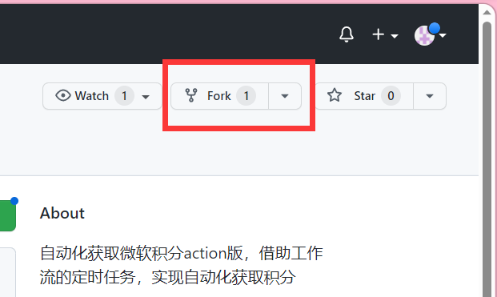
    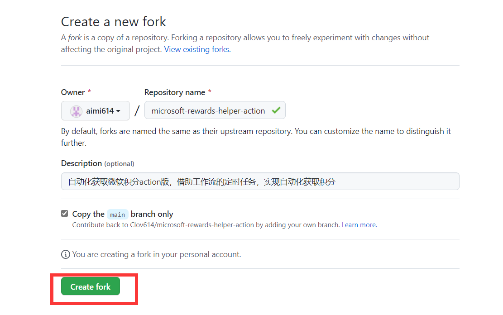
    fork至自己的仓库
</details>

### 2、设置环境变量(secret)

进入Settings，进入Action的Secret，添加Cookie将这个secret命名为MY_COOKIE，添加区域IP命名为IPS。

> "注意：您需要提供自己的Cookie信息，详情请参考获取Cookie部分。"

> IPS为需要刷取地区的ip(为了伪装ip随便都行),必须装在英文的中括号中不允许有空格，多个地址需要用英文逗号隔开，
> 示例： [14.102.128.0,2.59.154.0]

<details>
<summary>图片示例步骤</summary>
    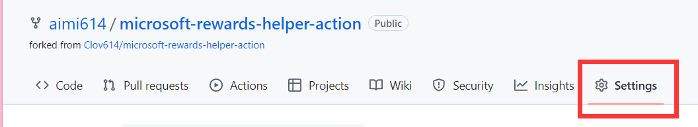
    进入settings
    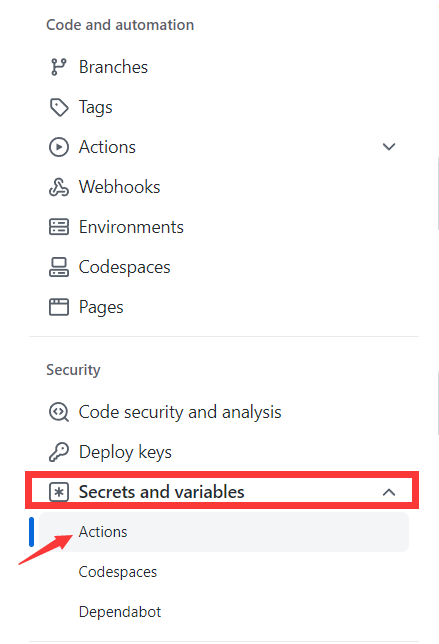
    进入Action的secret
    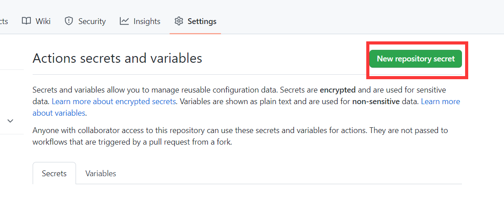
    新建secret
    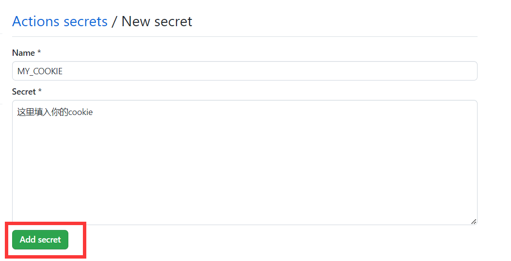
    添加cookie将这个secret命名为MY_COOKIE
    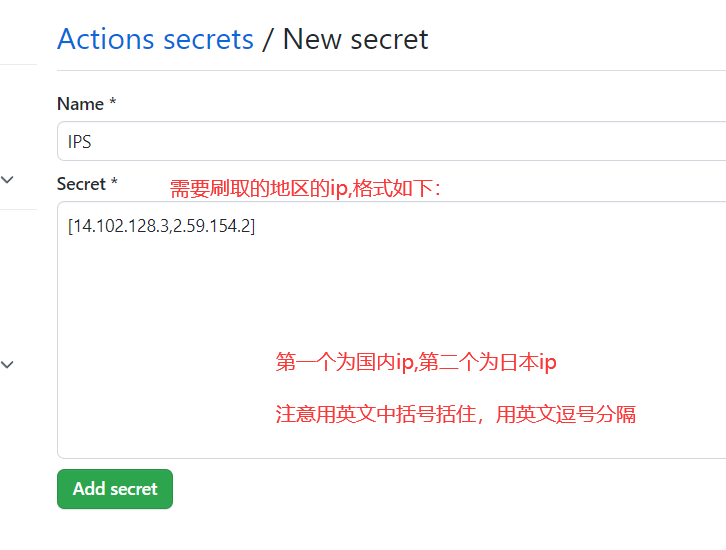
    IPS为需要刷取地区的ip，<a href="http://ip.bczs.net/country/JP">japanIP示例</a>
    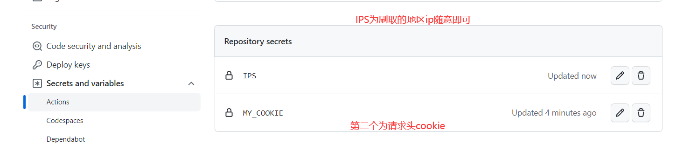
</details>


### 3、进入Action，并启用工作流

fork的仓库需要手动启用工作流，并且手动执行工作流，检查是否成功运行。

<details>
<summary>图片示例步骤</summary>
    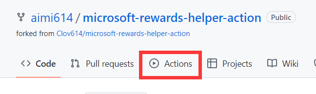
    进入action
    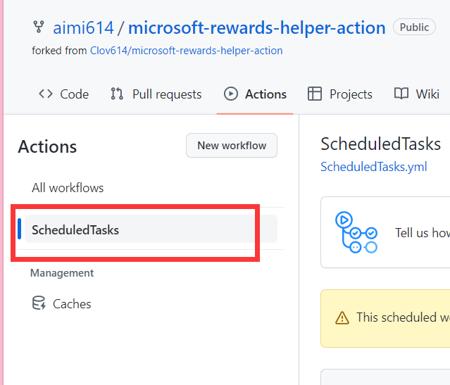
    选择ScheduledTasks这个定时任务的工作流
    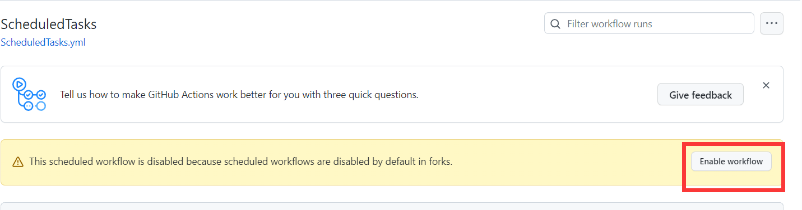
    启用该工作流
</details>


### 4、在action中手动执行workflow测试是否配置成功

>返回action 执行工作流并验证是否配置成功

<details>
<summary>图片示例步骤</summary>
    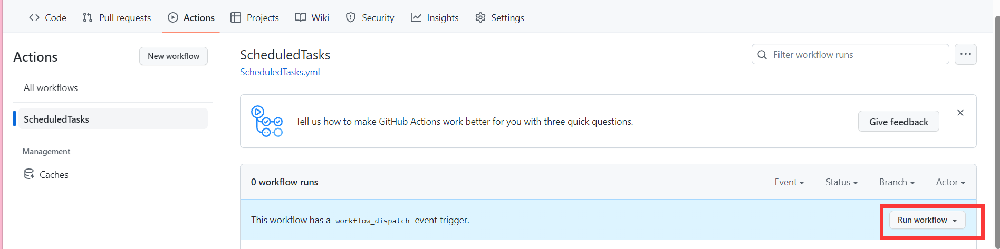
    返回action 执行工作流
    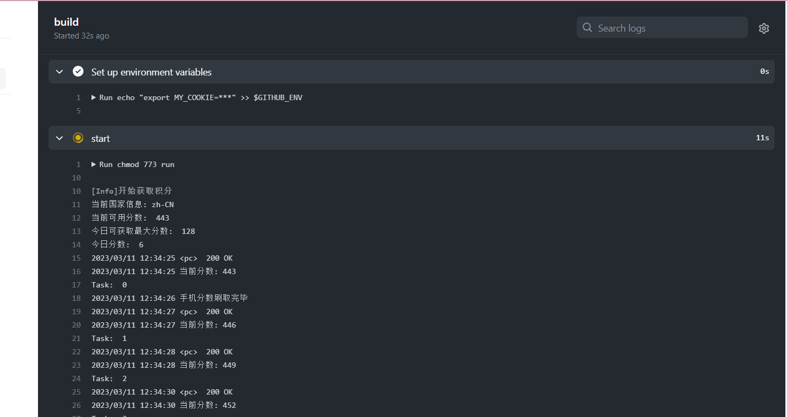
    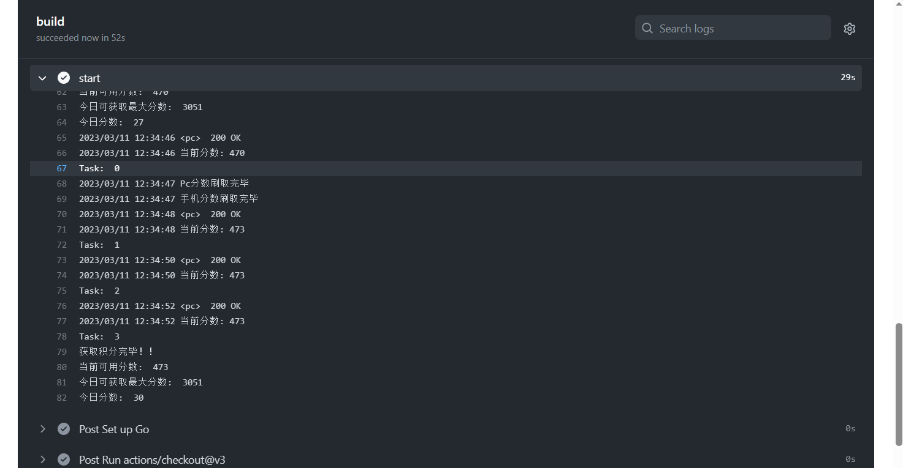
    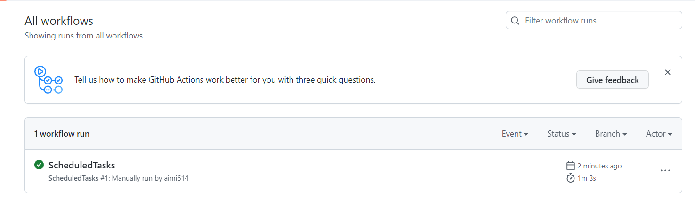
    验证是否配置成功
</details>

### 如何获取微软账号的cookie值

- 访问 https://rewards.bing.com/
- 打开开发者控制台并刷新页面，获取最新的请求包。
- 复制请求头中的cookie值并将其设置为名为“MY_COOKIE”的Secret。

<details>
<summary>图片步骤</summary>
    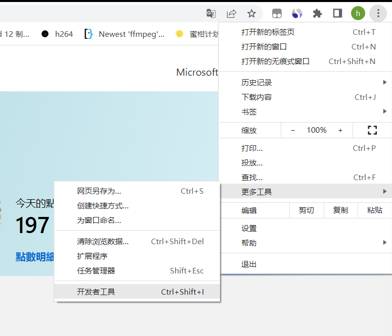
    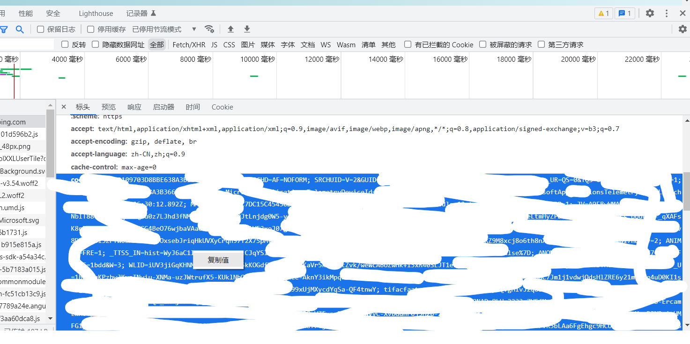
    cookie为header请求头中的cookie
</details>

### 工作流说明

该GitHub Action将在每天13点UTC+8（北京时间）自动执行任务

> `.github/workflows/ScheduledTasks.yml`的部分代码：

```yaml
name: ScheduledTasks
on:
  push:
    branches:
      - main
    tags:
      - "v*"
  schedule:
    - cron: '0 5 * * *' # 5:00 AM UTC
  workflow_dispatch:  # 添加 workflow_dispatch 事件触发器

```

### 相关项目

> [Clov614/Microsoft_Rewards_Helper](https://github.com/Clov614/Microsoft_Rewards_Helper)

